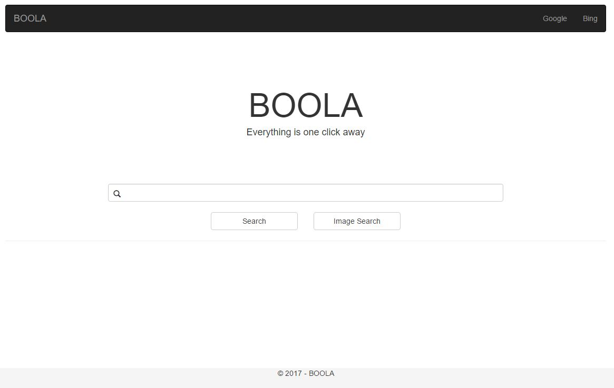

# APT BOOLA SearchEngine
Search Engine using Python, ASP.NET, HTML, SQL Server, and C# created by [Ahmad Mostafa](https://github.com/ahmad-mostafa1000), [Mohamed Mahmoud](https://github.com/Musgi), [Mohammed Omar](https://github.com/MohammedAlsayedOmar) and Mohammed Khamis as a university project for "Advanced Programing Techniques" course.



Status: **Completed**

## Prerequisite 
* [SQL Server 2014](https://www.microsoft.com/en-us/download/details.aspx?id=42299) or any other version
* IDE such as [Visual Studio](https://www.visualstudio.com/downloads/)
* Host for a local server such as [ISS Express](https://www.microsoft.com/en-us/download/details.aspx?id=48264)
* [Python 3.X](https://www.python.org/downloads/) and the [Natural Language Toolkit Package](http://www.nltk.org/install.html)


## Installation
#### A Setting up the project
1. Clone the repository to your PC using the command:
     ```
     git clone https://github.com/MohammedAlsayedOmar/APT-SearchEngine.git
     ```
2. There will be two different solutions. One for the Python project for crawler and indexer located inside **SearchEngN** folder and the other is for the ASP.NET project located inside **APT** folder.

#### B Setting up the Database
3. Browse to the **Databae** folder and run either **DatabaseSchemaOnly.sql** for tables only or **DatabaseSchemaAndData.sql** for both tables and data.
4. Inside the **Database** folder make sure you also run **DeleteEverything.sql** located inside **Useful Queries** folder to initialize the empty database.

#### C Connecting Both
5. Connect you IDE to you database server somehow and get a connection string.
6. Open **DataBase.py** inside **SearchEngN** project and change to connection string as needed.
7. Also do the same thing in **Controller.cs** and **Web.config** in the ASP.NET project located inside the **APT** folder
8. Create a folder named **MyImages** inside **APT/APT/Images** if it's not avaliable.
9. Copy the location of that folder and replace it in **IndexerMod.py** inside **SearchEngN** folder

## Running the project
1. First, Let's crawl and index some pages, Inside the python project, **SearchEngN**, mark **Search_Engine.py** as your starting path.
2. Make sure that **MyImages** folder is located inside **SearchEngN** directory because it is needed for the project to run.
2. Run your project and sit back for a while.
3. Now that you have crawled some data, Let's do some searching. Open the ASP.NET project inside **APT** folder and run it.

## License
This project is licensed under the MIT License - see the [LICENSE.md](LICENSE.md) file for details
